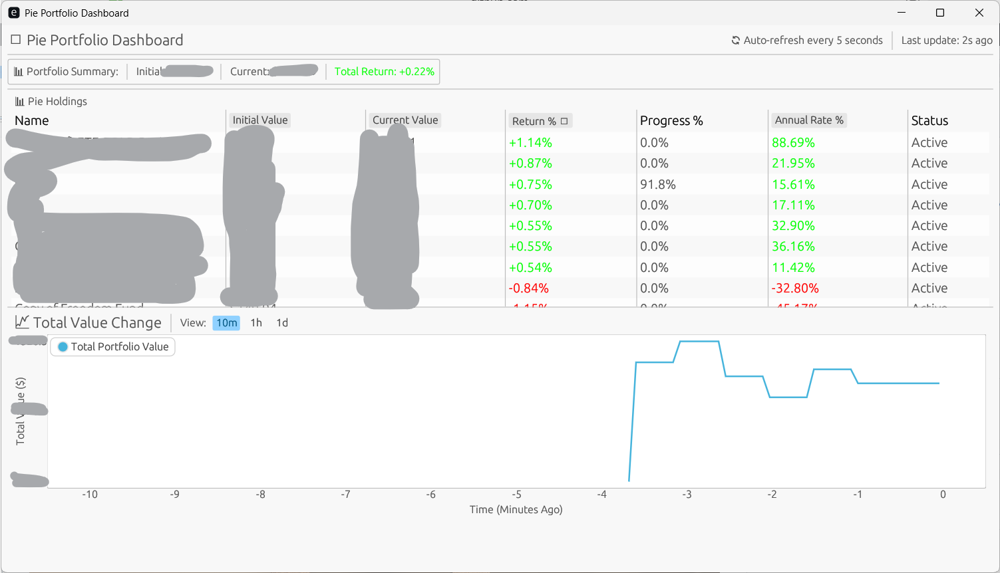

# Pie_top
A way to (just) look at your trading 212 pies.

## Setup
1. Get your trading212 api key (For safety, make it read-only)
2. Create a ```.env``` file like below
```
TRADE212_API_TOKEN=your_token_here

```
3. Run it
